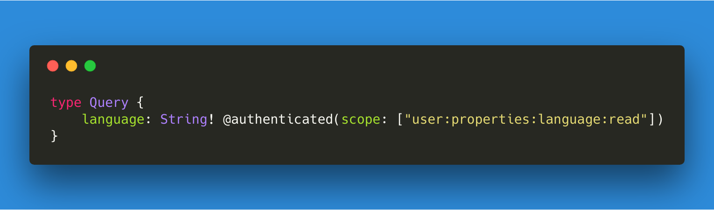

# authDirective

# [](https://github.com/wasc-io/graphql-authDirective)

## Overview

[Graphql-authDirective](https://github.com/wasc-io/graphql-authDirective) is a GraphQL-Directive for authenticating specific fields and types on your schema and also checking if the user has a valid scope.

# Preperation

The directive expects a `auth`-property on the graphql-context (in most cases the express-request). It should contain a `isAuthenticated` Boolean and an array of strings with [OAuth scopes](https://www.oauth.com/oauth2-servers/scope/defining-scopes/) on the scope property of the auth object.

```javascript
{
    auth: {
        isAuthenticated: true, // or false
        scope: ['user:properties:language:*', 'payments:*'],
    }
}
```

If you want to create a middleware which authenticates your user before the graphql schema, make sure to pass the request as a graphql-context to the resolvers. Look at the ApolloServer configuration below to verify your configuration.

## Usage

Currently this package is only tested with ApolloServer, and will only work with ApolloServer, since it uses apollo-specific errors to alert when the user is not authenticated.

To use it with ApolloServer 2.0 install it, import it and set it as a schema directive in the Server-Configuration:

```bash
npm i @wasc/graphql-authDirective
```

```javascript
import authenticateDirective from "@wasc/graphql-authDirective";

const apolloServer = new ApolloServer({
  typeDefs,
  resolvers,
  schemaDirectives: {
    authenticated: authenticateDirective
  },
  /**
   * This one is important, if you are using a middleware to check the users token
   * and set the auth object (described above), make sure to include the request
   * as the graphql-context
   */
  context: ({ req }) => req
});
```

and declare it in your schema:

```graphql
directive @authenticated(scope: [String]) on FIELD_DEFINITION | OBJECT
```

you can now specify the authentication of specific fields and Types

```graphql
type Query {
  language: String! @authenticated(scope: ["user:properties:language:read"])
}
```

## Have fun coding!
